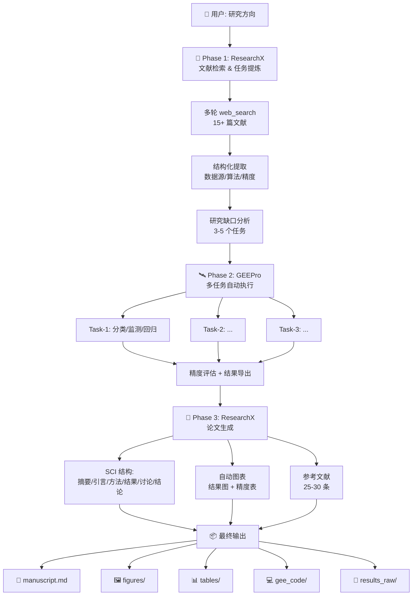

<p align="center">
  
</p>

<h1 align="center">🔨 PaperForge</h1>

<p align="center">
  <strong>Topic in. Paper out.</strong><br>
  <em>全自动遥感科研流水线 — 从研究方向到完整 SCI 论文，一键完成</em>
</p>

<p align="center">
  <a href="#-features">Features</a> •
  <a href="#-quick-start">Quick Start</a> •
  <a href="#-how-it-works">How It Works</a> •
  <a href="#-examples">Examples</a> •
  <a href="#-installation">Installation</a>
</p>

<p align="center">
  <a href="https://github.com/xingguangYan/PaperForge/stargazers"></a>
  <a href="https://github.com/xingguangYan/PaperForge/blob/main/LICENSE"></a>
</p>

---

## 🔥 What is PaperForge?

**PaperForge** 是一个端到端的智能科研流水线，集成了 **ResearchX**（文献挖掘、实验设计、论文写作）和 **GEEPro**（Google Earth Engine 代码执行）。你只需说出一个研究方向，PaperForge 就会自动完成：

```
📖 文献检索 → 🔍 研究缺口分析 → 🛰️ GEE 实验设计 → ⚡ 代码执行 → 📊 结果分析 → 📝 SCI 论文生成
```

---

## ✨ Features

| 阶段 | 自动完成的内容 |
|------|---------------|
| **📖 文献调研** | 自动检索 20-30 篇文献，提取数据源、算法、精度、创新点、局限 |
| **🔍 缺口分析** | 对比文献归纳 3-5 个研究方向缺口 |
| **🛰️ 实验设计** | 将缺口转为可执行 GEE 任务（含数据源、模型、评估指标） |
| **⚡ GEE 执行** | 自动生成并运行 GEE Python 代码，导出结果 |
| **📊 结果分析** | 自动精度评估 + 多算法对比 + 可视化 |
| **📝 论文生成** | SCI 结构论文：摘要→引言→方法→结果→讨论→结论→参考文献 |

---

## 🚀 Quick Start

```bash
# 1. Clone
git clone https://github.com/xingguangYan/PaperForge.git
cd PaperForge

# 2. Install
pip install -r requirements.txt

# 3. GEE Auth
earthengine authenticate

# 4. Run! 🎯
python scripts/run_pipeline.py \
    --topic "黄河流域植被覆盖度变化监测" \
    --project your-project-id \
    --region "黄河中游" \
    --time "2018-2023"
```

---

## 🔬 How It Works



---

## 📊 Examples

### 🏔️ 黄河流域植被覆盖度变化

```bash
python scripts/run_pipeline.py --topic "黄河流域植被覆盖度变化" --project my-project --region "黄河中游" --time "2018-2023"
```

**输出：**
```
✓ Phase 1: 35 篇文献，4 个任务
✓ Phase 2: 
  • Task-1: FVC(RF+S2) → R²=0.89
  • Task-2: LandTrendr 趋势 → 12% 下降
  • Task-3: 土地利用分类 → OA=0.93
  • Task-4: 退耕还林评估 → 森林+345km²
✓ Phase 3: 论文草稿 + 28 条参考文献
```

### 🌊 太湖富营养化监测

```bash
python scripts/run_pipeline.py --topic "太湖富营养化遥感监测" --project my-project --region "太湖" --time "2019-2023"
```

**输出：**
```
✓ Phase 1: 28 篇文献，3 个任务
✓ Phase 2:
  • Task-1: Chl-a 反演(OC3) → R²=0.85
  • Task-2: Chl-a 反演(RF) → R²=0.91
  • Task-3: 富营养化趋势 → 指数下降 8%
✓ Phase 3: 完整论文 + 25 条参考文献
```

### 🌆 城市热岛效应（仅方案）

```bash
python scripts/run_pipeline.py --topic "城市热岛效应" --dry-run
```

---

## 💻 CLI Options

```bash
python scripts/run_pipeline.py --topic "主题" [options]

Options:
  --project PROJECT_ID    GEE Project ID
  --region REGION         研究区域
  --time TIME             时间范围 (默认: 近5年)
  --tasks N               任务数量 3-5 (默认: 4)
  --format FORMAT         参考文献格式: gb/apa/mla (默认: gb)
  --no-deep               禁用深度学习
  --dry-run               仅生成方案不执行
  --phase PHASE           仅执行指定阶段: literature/gee/paper
```

---

## 🖥️ 跨平台支持

PaperForge 兼容所有主流 AI 编码助手：

| 平台 | 配置方式 |
|------|---------|
| **OpenAI Codex** | 复制到 skills 目录或 plugin 安装 |
| **Claude Desktop** | 自定义指令中引用 |
| **Cline** | `.clinerules` 中添加 |
| **Cursor** | `.cursorrules` 中添加 |
| **Windsurf** | `.windsurfrules` 中添加 |
| **GitHub Copilot** | `.github/copilot-instructions.md` 中添加 |

详见 `SKILL.md` 中的各平台配置说明。

---

## 📦 输出示例

```
outputs/20260611_143022_yellow_river/
├── manuscript.md              # 📄 完整论文
├── figures/                   # 🖼️ 结果图
│   ├── fig1_study_area.png
│   ├── fig2_fvc_map.png
│   ├── fig3_trend.png
│   └── fig4_landcover.png
├── tables/                    # 📊 数据表
│   ├── accuracy_task1.csv
│   ├── accuracy_task1.md
│   └── area_statistics.csv
├── gee_code/                  # 💻 GEE 脚本
│   ├── task1_code.py
│   ├── task2_code.py
│   ├── task3_code.py
│   └── task4_code.py
├── results_raw/               # 📁 原始数据
│   ├── task1_fvc.tif
│   └── ...
└── README.md                  # 复现说明
```

---

## 📦 Installation

```bash
# Clone
git clone https://github.com/xingguangYan/PaperForge.git
cd PaperForge

# 依赖
pip install -r requirements.txt

# GEE 认证
earthengine authenticate

# 环境验证
python scripts/check_environment.py --project YOUR_PROJECT_ID
```

---

## 🤝 Contributing

欢迎提交 Issue 和 PR！一起打造最强的遥感科研自动化流水线。

---

## 📄 License

MIT © [xingguangYan](https://github.com/xingguangYan)
