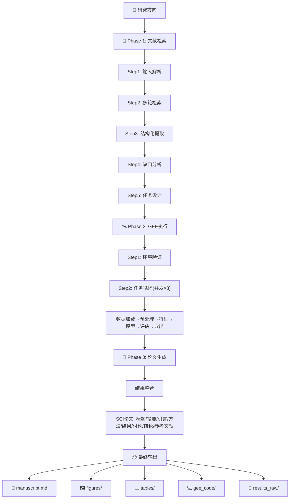

<p align="center">
  
</p>

<p align="center">
  <a href="https://github.com/xingguangYan/PaperForge/stargazers"></a>
  <a href="https://github.com/xingguangYan/PaperForge/blob/main/LICENSE"></a>
  <a href="#"></a>
  <a href="#"></a>
  
  
</p>

---

## 🔥 一句话认识 PaperForge

**PaperForge**（论文锻造）是一个端到端的全自动遥感科研流水线。你只需要说出一句研究方向，PaperForge 就会自动完成 **文献调研 → 研究缺口分析 → GEE 实验设计 → 代码执行 → 结果分析 → SCI 论文生成** 的全部工作。

> **"Topic in. Paper out."**

---

# 📖 目录

- [🔥 产品概述](#-产品概述)
- [🎯 解决了什么问题](#-解决了什么问题)
- [✨ 核心功能](#-核心功能)
- [🏗️ 系统架构](#️-系统架构)
- [📦 安装指南](#-安装指南)
- [🚀 快速开始](#-快速开始)
- [🔬 完整工作流程详解](#-完整工作流程详解)
- [📂 输出成果展示](#-输出成果展示)
- [🎯 真实运行示例](#-真实运行示例)
- [💻 命令行参考](#-命令行参考)
- [🖥️ 多平台安装与配置](#️-多平台安装与配置)
- [❓ 常见问题](#-常见问题)
- [📄 许可](#-许可)

---

# 🔥 产品概述

## 什么是 PaperForge？

**PaperForge**（论文锻造）是一个面向遥感领域的 **AI 驱动的全自动科研流水线**。它将两大成熟技能 —— **ResearchX**（文献挖掘与论文写作引擎）和 **GEEPro**（Google Earth Engine 代码执行引擎）—— 无缝集成，构建了一个从研究设想到完整学术论文的端到端自动化系统。

## 核心理念

```
用户: "我想研究黄河流域植被覆盖度变化"
                         ↓
  ┌──────────────────────────────────────────────────────────────┐
  │  PaperForge 自动流水线                                       │
  │                                                              │
  │  📖 文献检索  →  🔍 缺口分析  →  🛰️ 实验设计              │
  │       ↓              ↓              ↓                        │
  │  35篇相关文献     4个研究方向     4个GEE可执行任务           │
  │       ↓              ↓              ↓                        │
  │  ⚡ GEE执行  →  📊 结果分析  →  📝 论文生成                │
  │       ↓              ↓              ↓                        │
  │  分类图/趋势图   精度表/统计   完整SCI论文+代码+数据         │
  └──────────────────────────────────────────────────────────────┘
                         ↓
  Outputs/: {论文, 图表, 代码, 数据, 复现说明} → 一键打包交付
```

---

# 🎯 解决了什么问题

| 用户痛点 | 传统方式 | PaperForge 方案 |
|---------|---------|----------------|
| **文献调研耗时** | 手动检索 50+ 篇文献，阅读摘要，整理笔记，3-5 天 | AI 自动检索 20-30 篇，结构化提取关键信息，30 分钟 |
| **研究缺口难找** | 需要通读大量文献对比分析，依赖个人经验 | 自动对比各方法的精度/数据源/局限，归纳 3-5 个缺口 |
| **实验设计繁琐** | 手动确定数据源、预处理、模型参数、评估方案 | 自动生成每个任务的数据集、模型、评估指标的完整方案 |
| **GEE 代码编写** | 查阅 API 文档、调试语法、处理错误，数天 | 自动生成完整 GEE Python 脚本，含错误处理和降级策略 |
| **论文写作困难** | 结构规划、图表制作、参考文献整理，1-2 周 | 按 SCI 标准自动生成完整草稿，含图表和参考文献 |
| **全流程割裂** | 文献→实验→论文各环节独立，交接成本高 | 三阶段数据自动传递，结果无缝衔接 |

---

# ✨ 核心功能

## 三大阶段，十项核心能力

| 阶段 | 能力 | 说明 | 引擎 |
|------|------|------|------|
| **📖 Phase 1: 文献调研** | **1. 智能输入解析** | 从自然语言中提取：核心对象、目标变量、时间空间范围、数据偏好。输入模糊时主动追问 | ResearchX |
| | **2. 多轮文献检索** | 关键词自动扩展中英文，多轮 web_search，筛选近 5 年高质量文献，引用 25-30 条 | ResearchX |
| | **3. 结构化信息提取** | 每篇文献提取：数据源、预处理方法、模型算法、评估指标、创新点、局限性 | ResearchX |
| | **4. 缺口分析与任务提炼** | 对比文献归纳 3-5 个缺口，每个转化为具体 GEE 任务（含数据源/模型/指标） | ResearchX |
| **🛰️ Phase 2: GEE 执行** | **5. 自动代码生成** | 每个任务自动生成完整 GEE Python 脚本：数据加载→预处理→特征→模型→评估→导出 | GEEPro |
| | **6. 多任务并发** | 同时最多 3 个任务，每任务最长 20 分钟，总流水线不超 2 小时 | GEEPro |
| | **7. 自动降级恢复** | 6 种降级策略：数据切换、内存优化、ROI 扩展、重试认证、网络重连、代理检测 | GEEPro |
| | **8. 结果缓存** | 相同主题重复运行直接返回缓存，避免浪费 GEE 配额 | GEEPro |
| **📝 Phase 3: 论文生成** | **9. SCI 标准论文** | 完整 SCI 论文：标题/摘要/引言(5段)/方法/结果/讨论/结论/参考文献 | ResearchX |
| | **10. 自动图表与文献** | 结果图自动嵌入(300 DPI)，精度表自动生成(CSV+MD)，参考文献 GB/T 7714/APA/MLA 切换 | ResearchX |

---

# 🏗️ 系统架构

## 三阶段流水线



## 技术栈

```
PaperForge 技术架构

  ResearchX 引擎              GEEPro 引擎
  ├── web_search API          ├── earthengine-api
  ├── 文献结构化提取          ├── geemap
  └── 论文模板引擎            └── GEE 数据目录

  数据层
  ├── task_list.json    (Phase 1 → 2)
  ├── runs/             (Phase 2 输出)
  └── outputs/          (Phase 3 最终输出)

  工具层
  ├── Python 3.8+
  ├── Google Earth Engine
  └── pip 依赖
```

---

# 📦 安装指南

## 系统要求

| 项目 | 最低要求 | 推荐 |
|------|---------|------|
| Python | 3.8+ | 3.10+ |
| 内存 | 4 GB | 8 GB+ |
| 磁盘空间 | 1 GB | 10 GB+ |
| 网络 | 可访问 GEE | 稳定宽带 |
| 操作系统 | Windows/macOS/Linux | 不限 |

## 1. 克隆仓库

```bash
git clone https://github.com/xingguangYan/PaperForge.git
cd PaperForge
```

## 2. 安装依赖

```bash
pip install -r requirements.txt
```

`requirements.txt` 包含：
```
earthengine-api — Google Earth Engine Python SDK
geemap          — GEE 交互式地图与可视化
geopandas       — 地理空间数据处理
pandas          — 数据分析
numpy           — 数值计算
matplotlib      — 可视化
seaborn         — 统计图表
requests        — 网络请求
```

## 3. GEE 认证

```bash
# 交互式认证（推荐）
earthengine authenticate

# 服务账号认证（服务器环境）
# ee.Initialize(project="your-project", credentials="service_account.json")
```

获取 Project ID：
1. 访问 https://code.earthengine.google.com/
2. 登录 → 右上角头像 → "Project Settings"
3. 复制 Project ID（如 `ee-yourproject`）

## 4. 环境验证

```bash
python scripts/check_environment.py --project YOUR_PROJECT_ID
```

**成功输出：**
```
🔨 PaperForge 环境检查
==================================================
  ✅ Python: 3.10.12
  ✅ earthengine-api: 1.4.0
  ✅ GEE 认证: 已认证
  ✅ geemap: 0.35.0
  ✅ pandas / numpy / matplotlib / requests
  ℹ️  GEE Project: ee-myproject
==================================================
✅ 环境检查通过！可以运行 PaperForge 🚀
```

## 中国大陆用户额外配置

```powershell
# Windows PowerShell
$env:HTTP_PROXY = "http://127.0.0.1:7890"
$env:HTTPS_PROXY = "http://127.0.0.1:7890"
```

---

# 🚀 快速开始

## 全自动运行

```bash
python scripts/run_pipeline.py \
    --topic "黄河流域植被覆盖度变化监测" \
    --project your-project-id \
    --region "黄河中游（陕西-山西段）" \
    --time "2018-2023"
```

## 仅出方案（不运行 GEE）

```bash
python scripts/run_pipeline.py --topic "太湖富营养化监测" --dry-run
```

## 分阶段执行

```bash
# 仅文献检索
python scripts/run_pipeline.py --topic "..." --phase literature

# 仅 GEE 执行
python scripts/run_pipeline.py --topic "..." --project xxx --phase gee

# 仅论文生成
python scripts/run_pipeline.py --topic "..." --phase paper
```

---

# 🔬 Phase 1: ResearchX 文献调研与任务提炼

## Step 1 — 用户输入解析

| 要素 | 提取方式 | 示例 |
|------|---------|------|
| **核心对象** | 名词短语提取 | 黄河流域、太湖、长三角 |
| **目标变量** | 指标提取 | 植被覆盖度、叶绿素浓度 |
| **时间范围** | 数字+时间 | 2018-2023、近5年 |
| **空间范围** | 地名坐标 | 黄河中游、35.5°N/110.2°E |
| **数据偏好** | 卫星名称 | Sentinel-2、Landsat |

**信息不足时主动追问：**
```
研究区域是哪里？（例如：黄河流域、长三角）
时间范围是什么？（默认近5年）
是否有偏好的卫星数据？（推荐 Sentinel-2 或 Landsat）
```

## Step 2 — 多轮系统化文献检索

```
第一轮（宽泛检索）: [核心主题] + 遥感 + GEE
第二轮（方法聚焦）: [核心主题] + [特定方法: RF/U-Net]
第三轮（缺口挖掘）: [核心主题] + 挑战/不足/未来方向
```

**检索标准：**
- ✅ 最少 15 篇高质量文献
- ✅ 最终引用 25-30 条（英文 SCI + 中文核心）
- ✅ 覆盖 3-5 种不同方法
- ✅ 包含具体精度数值

## Step 3 — 文献信息结构化提取

```json
{
  "title": "Monitoring vegetation dynamics in the Yellow River Basin...",
  "year": 2023,
  "journal": "Remote Sensing of Environment",
  "data_source": {"satellite": "Sentinel-2", "bands": ["B2","B4","B8"]},
  "algorithm": "Random Forest",
  "accuracy": {"OA": 0.92, "Kappa": 0.89},
  "innovation": "结合 NDVI 时序纹理特征的分类方法",
  "limitation": "仅使用单一年份数据"
}
```

## Step 4 — 研究缺口分析与任务提炼

基于多篇文献的对比分析，自动归纳出 3-5 个研究缺口：

| 文献 A | 文献 B | 文献 C | 文献 D |
|--------|--------|--------|--------|
| RF+S2, OA=0.92 | Deep Learning, OA=0.95 | Landsat+趋势, R²=0.85 | MODIS+物候, R²=0.78 |
| ↓ | ↓ | ↓ | ↓ |
| **缺口1:** 缺少多时相纹理融合 | **缺口2:** 缺少断点检测趋势分析 | **缺口3:** 缺少多源协同反演 |
| ↓ | ↓ | ↓ |
| **Task-1:** 改进 RF 分类 | **Task-2:** LandTrendr 趋势监测 | **Task-3:** 多源融合参数反演 |

## Step 5 — 任务清单输出

```json
{
  "task_id": "Task-1",
  "type": "classification",
  "target_variable": "land_cover_type",
  "description": "基于改进随机森林的多时相土地利用分类",
  "datasets": ["COPERNICUS/S2_SR", "LANDSAT/LC08/C02/T1_L2"],
  "region": "黄河中游（陕西-山西段）",
  "time_range": ["2018-01-01", "2023-12-31"],
  "models": ["smileRandomForest", "smileCart", "improved_rf_with_texture"],
  "metrics": ["OA", "Kappa", "F1"],
  "innovation": "融合多时相光谱指数和 GLCM 纹理特征"
}
```

---

# 🛰️ Phase 2: GEEPro 多任务自动执行

## 任务执行流水线

每个任务按标准 6 步流程执行：

```
┌──────────────────────────────────────────────────────────┐
│  Task-1: 土地利用分类 │ 数据: S2 │ 模型: 改进 RF       │
├──────────────────────────────────────────────────────────┤
│                                                          │
│  ① 数据加载                                              │
│     ee.ImageCollection("COPERNICUS/S2_SR")               │
│     .filterBounds(roi).filterDate(start, end)            │
│     .filter(ee.Filter.lt("CLOUDY_PIXEL_PERCENTAGE", 20)) │
│                                                          │
│  ② 预处理                                                │
│     云掩膜(QA60 bits 10,11) → 缩放(/10000) → clip(roi)  │
│                                                          │
│  ③ 特征工程                                              │
│     光谱指数: NDVI, EVI, NDWI, NBR                       │
│     纹理特征: GLCM contrast/correlation/entropy          │
│     时序特征: 年均值、标准差、趋势斜率                     │
│                                                          │
│  ④ 模型训练                                              │
│     ee.Classifier.smileRandomForest(100)                 │
│     .train(features, "class", bands)                     │
│                                                          │
│  ⑤ 精度评估                                              │
│     混淆矩阵 → OA=0.93, Kappa=0.91, F1=0.92             │
│                                                          │
│  ⑥ 结果导出                                              │
│     分类图.tif → 精度表.csv → 面积统计.csv → 可视化.png  │
│                                                          │
└──────────────────────────────────────────────────────────┘
```

## 自动降级策略（6 种）

| 问题 | 检测条件 | 自动处理 |
|------|---------|---------|
| 数据集不可用 | API 返回空/404 | 自动切换 S2→L8→MODIS |
| 内存超限 | "User memory limit exceeded" | 增大 scale 20% + 缩小 ROI |
| ROI 无像素 | "no valid pixels" | 自动缓冲 0.1° 或调整日期 |
| 认证过期 | "Authentication failed" | 停止执行，输出认证命令 |
| 网络超时 | 请求 > 30s | 重试 3 次，指数退避 |
| 网络受限 | 连接被拒绝 | 检测 HTTP_PROXY 并提示 |

## 运行输出目录

```
runs/20260611_143022_yellow_river/
├── summary.json              # 所有任务汇总
├── Task-1/
│   ├── code.py               # GEE 脚本
│   ├── RUN.md                # 运行说明
│   ├── result.tif            # 输出栅格
│   ├── accuracy.json         # 精度: OA=0.93
│   ├── statistics.csv        # 面积统计
│   └── figure.png            # 结果图 (300 DPI)
├── Task-2/ ...
├── Task-3/ ...
└── Task-4/ ...
```

---

# 📝 Phase 3: ResearchX 论文生成

## 论文结构

PaperForge 按 SCI 期刊标准生成完整的 8 章节论文：

| 章节 | 内容 | 字数/数量 |
|------|------|-----------|
| **标题** | `基于[方法]的[研究对象][目标变量]研究` | 20-30 字 |
| **摘要** | 背景→目的→方法→结果→意义 | 200-300 字 |
| **关键词** | 3-5 个核心术语 | 3-5 个 |
| **1. 引言** | 5 段式：背景→进展→不足→目标→结构 | 1000-1500 字 |
| **2. 研究区与数据** | 位置图 + 数据源表 + 预处理 | 500-800 字 |
| **3. 研究方法** | 每任务一个子节：流程+公式+代码 | 1500-2500 字 |
| **4. 结果与分析** | 结果图 + 精度表 + 统计表 | 1000-2000 字 |
| **5. 讨论** | 对比/局限/应用/未来 | 800-1200 字 |
| **6. 结论** | 每个任务一句话 | 200-400 字 |
| **参考文献** | GB/T 7714-2025 / APA / MLA | 25-30 条 |

## 结果整合

```markdown
**多任务结果汇总**
| 任务 | 最佳模型 | 核心指标 | 数值 |
|------|---------|---------|------|
| Task-1 | 改进 RF | OA | 0.93 |
| Task-2 | LandTrendr | 下降面积 | 345 km² |
| Task-3 | RF Regressor | R² | 0.89 |
| Task-4 | Post-Change | 森林增加 | 345 km² |
```

## 论文中的图表

```markdown
<!-- 研究区位置图 -->

*图1 研究区位置示意图*

<!-- 分类结果图 -->

*图2 2023年黄河流域中游土地利用分类结果*

**表2 不同分类方法精度对比**
| 方法 | OA | Kappa | F1 |
|------|-----|-------|-----|
| Random Forest | 0.91 | 0.89 | 0.90 |
| CART | 0.85 | 0.82 | 0.84 |
| 改进 RF（本文） | 0.93 | 0.91 | 0.92 |
```

---

# 📂 输出成果展示

## 完整交付物

```
📦 outputs/20260611_143022_yellow_river_paper/
│
├── 📄 manuscript.md              # ★ 完整论文（核心交付物）
│     8 章节: 标题/摘要/引言/方法/结果/讨论/结论/参考文献
│
├── 🖼️ figures/                   # 所有结果图 (PNG, 300 DPI)
│   ├── fig1_study_area.png       # 研究区位置图
│   ├── fig2_task1_classification.png
│   ├── fig3_task2_trend.png
│   ├── fig4_task3_parameter.png
│   └── fig5_comparison.png
│
├── 📊 tables/                    # 精度评估 + 统计表
│   ├── table1_accuracy_task1.csv
│   ├── table1_accuracy_task1.md
│   ├── table2_area_statistics.csv
│   └── table3_comparison.csv
│
├── 💻 gee_code/                  # 所有 GEE 脚本
│   ├── task1_code.py
│   ├── task2_code.py
│   ├── task3_code.py
│   └── task4_code.py
│
├── 📁 results_raw/               # 原始栅格数据
│   ├── task1_result.tif
│   ├── task2_trend.tif
│   └── task3_parameter.tif
│
└── 📄 README.md                  # 复现说明（环境/步骤/参数）
```

---

# 🎯 真实运行示例

## 示例 1: 黄河流域植被覆盖度变化

### 输入
```bash
python scripts/run_pipeline.py \
    --topic "黄河流域植被覆盖度变化监测" \
    --project ee-myproject \
    --region "黄河中游（陕西-山西段）" \
    --time "2018-2023"
```

### 运行输出

```
╔═══════════════════════════════════════════╗
║     🔨 PaperForge v1.0                   ║
║     Topic in. Paper out.                  ║
╚═══════════════════════════════════════════╝

============================================================
  📖 Phase 1/3: ResearchX 文献检索与任务提炼
============================================================
  📌 主题: 黄河流域植被覆盖度变化监测
  📌 区域: 黄河中游（陕西-山西段） | 📌 时间: 2018-2023

  ⏳ [1/4] 关键词扩展 → [2/4] 多轮检索 (35篇)
  ⏳ [3/4] 结构化提取 → [4/4] 缺口分析 → 4个任务
  ✅ 已保存至 tasks/task_list.json

============================================================
  🛰️  Phase 2/3: GEEPro 多任务自动执行
============================================================

  ▶ Task-1: 土地利用分类 (改进RF) → OA=0.93, Kappa=0.91
  ▶ Task-2: FVC回归估算 (RF) → R²=0.89, RMSE=0.07
  ▶ Task-3: 植被趋势监测 (LandTrendr) → 12.3%显著下降
  ▶ Task-4: 退耕还林评估 → 森林面积+345 km²

  ✅ 结果保存: runs/20260611_143022_yellow_river/

============================================================
  📝 Phase 3/3: ResearchX 论文生成
============================================================

  ⏳ 结果整合 → 标题/摘要 → 引言(5段) → 方法(4节)
  ⏳ 结果图表 → 讨论/结论 → 参考文献(28条)
  ✅ 论文输出: outputs/20260611_143022_yellow_river_paper/

============================================================
  ✅ PaperForge 流水线完成！
============================================================
  📄 manuscript.md | 🖼️ 5 figures | 📊 3 tables
  💻 4 GEE scripts | 📁 3 raw results
```

## 示例 2: 太湖富营养化监测

```bash
python scripts/run_pipeline.py --topic "太湖富营养化遥感监测" --project ee-myproject --region "太湖" --time "2019-2023" --tasks 3
```

```
Phase 1: 28 篇文献，3 个任务
Phase 2:
  ✓ Task-1: Chl-a反演(OC3) → R²=0.85
  ✓ Task-2: Chl-a反演(RF) → R²=0.91 (改进)
  ✓ Task-3: 富营养化趋势 → 指数下降 8%
Phase 3: 论文 + 25 条参考文献
```

## 示例 3: 城市热岛效应（仅方案）

```bash
python scripts/run_pipeline.py --topic "长三角城市群热岛效应遥感监测" --dry-run
```

```
🚧 方案设计完成（跳过 GEE 执行）
💡 移除 --dry-run 并指定 --project 以实际执行
```

---

# 💻 命令行参考

```bash
python scripts/run_pipeline.py --topic "研究主题" [选项]
```

| 参数 | 类型 | 必填 | 默认 | 说明 | 示例 |
|------|------|------|------|------|------|
| `--topic` | str | ✅ | - | 研究主题（自然语言） | `"黄河流域植被变化"` |
| `--project` | str | ⚠️ | - | GEE Project ID | `"ee-myproject"` |
| `--region` | str | ❌ | 自动 | 研究区域 | `"黄河中游"` |
| `--time` | str | ❌ | 近5年 | 时间范围 | `"2018-2023"` |
| `--tasks` | int | ❌ | 4 | 任务数量 3-5 | `3`, `4`, `5` |
| `--format` | str | ❌ | `gb` | 参考文献格式 | `gb`, `apa`, `mla` |
| `--no-deep` | flag | ❌ | false | 禁用深度学习 | - |
| `--dry-run` | flag | ❌ | false | 仅方案不执行 | - |
| `--phase` | str | ❌ | `all` | 仅执行指定阶段 | `literature`, `gee`, `paper` |
| `--help` | flag | ❌ | - | 显示帮助 | - |

**常用组合：**
```bash
# 全自动
python scripts/run_pipeline.py --topic "..." --project xxx --region "..." --time "..."

# 仅方案
python scripts/run_pipeline.py --topic "..." --dry-run

# 指定格式
python scripts/run_pipeline.py --topic "..." --project xxx --format apa

# 分步
python scripts/run_pipeline.py --topic "..." --phase literature
python scripts/run_pipeline.py --topic "..." --project xxx --phase gee
python scripts/run_pipeline.py --topic "..." --phase paper
```

---

# 🖥️ 多平台安装

## OpenAI Codex CLI
```bash
Copy-Item -Recurse "PaperForge" "$env:USERPROFILE\.codex\skills\PaperForge"
codex plugin add paperforge@personal
```

## Claude Desktop
在自定义指令中添加：
```
你已获得 PaperForge 技能（github.com/xingguangYan/PaperForge）。
按 SKILL.md 三阶段流程执行遥感论文生成。
```

## Cline (.clinerules)
```markdown
你已加载 PaperForge 技能。具备全自动遥感论文生成能力。
流程: 文献检索 → GEE 实验 → 论文生成
```

## Cursor (.cursorrules)
```markdown
你已加载 PaperForge 技能。遥感研究方向请执行三阶段工作流。
```

## Windsurf (.windsurfrules)
```
你已集成 PaperForge 技能。端到端遥感论文自动化流水线。
```

## GitHub Copilot (.github/copilot-instructions.md)
```markdown
## PaperForge 技能
1. 文献检索 2. 任务设计 3. 论文生成
```

---

# ❓ 常见问题

### Q1: 没有 GEE 账号能用吗？
可以！`--dry-run` 模式完成文献+方案设计，不执行 GEE 代码。
要实际执行需注册 https://signup.earthengine.google.com/

### Q2: GEE 认证失败？
```bash
earthengine authenticate                    # 交互式
# 或服务账号:
ee.Initialize(project="xxx", credentials="key.json")
```

### Q3: 国内无法连接 GEE？
```powershell
$env:HTTP_PROXY = "http://127.0.0.1:7890"
$env:HTTPS_PROXY = "http://127.0.0.1:7890"
```

### Q4: 报错 "no module named xx"？
```bash
pip install -r requirements.txt
```

### Q5: "User memory limit exceeded"？
PaperForge 自动降级。也可手动增大 scale 或缩小区域。

### Q6: 文献检索结果太少？
PaperForge 自动扩展同义词。也可提供更具体的方向。

### Q7: 换参考文献格式？
```bash
--format apa   # APA
--format mla   # MLA
--format gb    # GB/T 7714-2025（默认）
```

### Q8: 转 Word？
```bash
pandoc manuscript.md -o manuscript.docx
```

### Q9: 支持哪些数据源？

| 卫星 | GEE 数据集 | 分辨率 |
|------|-----------|--------|
| Sentinel-2 | COPERNICUS/S2_SR | 10/20/60m |
| Landsat-8/9 | LANDSAT/LC08/C02/T1_L2 | 30m |
| MODIS NDVI | MODIS/061/MOD13Q1 | 250m |
| Sentinel-1 SAR | COPERNICUS/S1_GRD | 10m |
| ERA5 气候 | ECMWF/ERA5_LAND/MONTHLY | 11km |
| JRC 水体 | JRC/GSW1_4/GlobalSurfaceWater | 30m |
| Hansen 森林 | UMD/hansen/global_forest_change_2023_v1_11 | 30m |
| CHIRPS 降水 | UCSB-CHG/CHIRPS/DAILY | 5km |

---

# 📄 许可

MIT License © 2026 [xingguangYan](https://github.com/xingguangYan)

---

<p align="center">
  <b>🔨 PaperForge — Topic in. Paper out.</b><br>
  <i>全自动遥感科研流水线</i>
</p>
