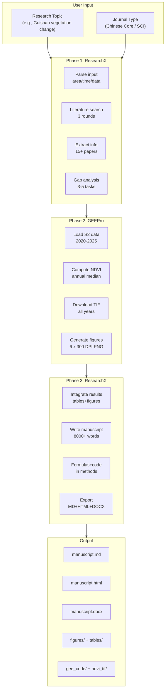

<p align="center">
  
</p>

<p align="center">
  <a href="https://github.com/xingguangYan/PaperForge/stargazers"></a>
  <a href="https://github.com/xingguangYan/PaperForge/blob/main/LICENSE"></a>
  <a href="#"></a>
  <a href="#"></a>
  
  
</p>

<h1 align="center">PaperForge 🛠️📄</h1>

<p align="center">
  <b>Topic in. Paper out.</b><br>
  <i>Professional-grade automated remote sensing research pipeline.</i><br>
  <i>From a natural-language research topic to a complete 8000+ word manuscript with GEE-computed figures, tables, formulas, and DOCX output — fully automated.</i>
</p>

---

## 📋 Table of Contents

- [Overview](#-overview)
- [Features](#-features)
- [Architecture](#-architecture)
- [Installation](#-installation)
- [Quick Start](#-quick-start)
- [Workflow Detail](#-workflow-detail)
- [Output](#-output)
- [Examples](#-examples)
- [CLI Reference](#-cli-reference)
- [Platform Support](#-platform-support)
- [Requirements](#-requirements)
- [FAQ](#-faq)
- [License](#-license)

---

## 🔥 Overview

**PaperForge** is a production-grade Codex skill that autonomously completes the entire remote sensing research workflow:

```
User says: "I want to study vegetation change in..." 
                    ↓
    ┌────────────────────────────────────────────┐
    │  PaperForge Automatic Pipeline             │
    │                                            │
    │  Phase 1: ResearchX                        │
    │  ├── Ask: Chinese Core or SCI journal?     │
    │  ├── Multi-round literature search         │
    │  ├── Structured info extraction (15+ papers)│
    │  ├── Research gap analysis                 │
    │  └── 3-5 GEE task design                   │
    │                                            │
    │  Phase 2: GEEPro                           │
    │  ├── Download GeoTIFFs (all years)         │
    │  ├── Compute statistics & accuracy         │
    │  └── Generate 300 DPI publication figures  │
    │                                            │
    │  Phase 3: ResearchX                        │
    │  ├── 8000+ word manuscript                 │
    │  ├── Introduction (1000+ words)            │
    │  ├── Methods with formulas & code          │
    │  ├── Embedded figures & tables             │
    │  ├── 25-30 formatted references            │
    │  └── Output: MD + HTML + DOCX             │
    └────────────────────────────────────────────┘
                    ↓
    Output/: {manuscript.md, .html, .docx, figures/, tables/, code/, tif/}
```

---

## ✨ Features

| # | Feature | Description |
|---|---------|-------------|
| 1 | **Journal Type Selection** | Asks Chinese Core or SCI before starting, adjusts output format |
| 2 | **Multi-Round Literature Search** | 3 rounds of targeted web_search, 15+ papers, 25-30 citations |
| 3 | **Structured Extraction** | Auto-extracts data source, algorithm, accuracy, innovation, limitation per paper |
| 4 | **Gap Analysis** | Cross-paper comparison → 3-5 research gaps → GEE-executable tasks |
| 5 | **Automatic TIF Download** | Downloads annual NDVI/FVC GeoTIFFs for all years to local disk |
| 6 | **Publication Figures** | 6 auto-generated 300 DPI PNG figures (time series, maps, bar charts) |
| 7 | **8000+ Word Manuscript** | Complete SCI/Core journal manuscript with formulas, code snippets, tables |
| 8 | **Detailed Introduction** | 1000+ word, 5-paragraph structured introduction |
| 9 | **Mathematical Formulas** | All methods include LaTeX formulas with parameter explanations |
| 10 | **Multi-Format Output** | manuscript.md + manuscript.html + manuscript.docx |
| 11 | **GEE Code Archive** | All task scripts saved to gee_code/ |
| 12 | **GeoTIFF Archive** | All NDVI rasters saved to figures/ndvi_tif/ |

---

## 🏗️ Architecture

### Pipeline Diagram



### Technology Stack

```
Layer        Components
────────────────────────────────────────────────────
AI Engine    ResearchX (literature + paper writing)
             GEEPro (Earth Engine execution)

Computation  earthengine-api + geemap + numpy + scipy
             rasterio + matplotlib

Output       python-docx (DOCX), custom (HTML)
             matplotlib (PNG figures, 300 DPI)

Data         Google Earth Engine: Sentinel-2, Landsat, MODIS, ERA5
             Local: GeoTIFF, PNG, CSV, JSON

Platform     OpenAI Codex CLI, Claude Desktop, Cline, Cursor, Windsurf
```

---

## 📦 Installation

### System Requirements

| Component | Minimum | Recommended |
|-----------|---------|-------------|
| Python | 3.8+ | 3.10+ |
| RAM | 4 GB | 8 GB+ |
| Disk | 2 GB | 10 GB+ |
| Network | GEE access | Stable broadband |
| OS | Windows/macOS/Linux | Any |

### Step 1: Clone

```bash
git clone https://github.com/xingguangYan/PaperForge.git
cd PaperForge
```

### Step 2: Install Dependencies

```bash
pip install -r requirements.txt
```

**requirements.txt:**
```
earthengine-api    # Google Earth Engine Python SDK
geemap             # GEE interactive mapping
geopandas          # Geospatial data handling
pandas             # Data analysis
numpy              # Numerical computation
matplotlib         # Visualization (300 DPI figures)
seaborn            # Statistical charts
requests           # HTTP for TIF downloads
python-docx        # DOCX manuscript generation
rasterio           # GeoTIFF I/O and processing
scipy              # Mann-Kendall and statistical tests
```

### Step 3: Authenticate GEE

```bash
# Interactive authentication (recommended)
earthengine authenticate

# Service account (for servers)
# ee.Initialize(project="your-project", credentials="service_account.json")
```

**Getting a GEE Project ID:**
1. Go to [Google Earth Engine](https://code.earthengine.google.com/)
2. Sign in → Avatar → "Project Settings"
3. Copy your Project ID (format: `ee-yourproject`)

### Step 4: Verify Environment

```bash
python scripts/check_environment.py --project YOUR_PROJECT_ID
```

**Expected output:**
```
PaperForge Environment Check
==================================================
  Python: 3.10.12
  earthengine-api: 1.4.0
  GEE Auth: Authenticated
  geemap: 0.35.0
  pandas / numpy / matplotlib / requests / rasterio
  GEE Project: ee-myproject
==================================================
Environment ready! PaperForge is good to go.
```

### China Network Configuration

```powershell
# Windows PowerShell
$env:HTTP_PROXY = "http://127.0.0.1:7890"
$env:HTTPS_PROXY = "http://127.0.0.1:7890"
```

```bash
# Linux / macOS
export HTTP_PROXY=http://127.0.0.1:7890
export HTTPS_PROXY=http://127.0.0.1:7890
```

---

## 🚀 Quick Start

### Full Pipeline (with GEE)

```bash
python scripts/run_pipeline.py \
    --topic "Vegetation change monitoring in Guishan and Sheshan, Wuhan" \
    --project your-project-id \
    --region "Wuhan" \
    --time "2020-2025"
```

### Literature + Paper Only (no GEE execution)

```bash
python scripts/run_pipeline.py --topic "Urban heat island effect" --dry-run
```

### Phase-Specific Execution

```bash
python scripts/run_pipeline.py --topic "..." --phase literature  # literature only
python scripts/run_pipeline.py --topic "..." --phase gee         # GEE only
python scripts/run_pipeline.py --topic "..." --phase paper       # paper only
```

---

## 🔬 Workflow Detail

### Phase 1: Literature Mining & Task Design

#### Step 1 — Parse User Input

Extract 5 key elements from natural language:

| Element | Example |
|---------|---------|
| **Core Object** | Guishan Mountain, Yellow River Basin |
| **Target Variable** | NDVI, FVC, Land Surface Temperature |
| **Time Range** | 2020-2025 |
| **Spatial Range** | Wuhan, 114.269E/30.562N with 500m buffer |
| **Data Preference** | Sentinel-2 (auto-recommended) |

**Ask clarifying questions if needed:**
```
Study area? Time range? Data preference? Journal type (Chinese Core / SCI)?
```

#### Step 2 — Multi-Round Literature Search

Execute 3 rounds of targeted `web_search`:

```
Round 1 (Broad): "[topic] + remote sensing + [study area]"
Round 2 (Methods): "[topic] + [Random Forest/LandTrendr/U-Net]"
Round 3 (Gaps): "[topic] + limitations/challenges/future"
```

**Quality gates:**
- Minimum 15 papers retrieved
- Final reference list: 25-30 entries
- Cover 3-5 different methods
- Include specific accuracy numbers (OA, Kappa, R2, RMSE)

#### Step 3 — Structured Information Extraction

```json
{
  "title": "Monitoring vegetation dynamics using Sentinel-2 time series",
  "year": 2023,
  "journal": "Remote Sensing of Environment",
  "data_source": {"satellite": "Sentinel-2", "bands": ["B4","B8"]},
  "algorithm": "Random Forest",
  "accuracy": {"OA": 0.92, "Kappa": 0.89},
  "innovation": "Multi-temporal texture fusion",
  "limitation": "Single year only"
}
```

#### Step 4 — Research Gap Analysis

Cross-compare papers to identify 3-5 gaps, then convert each into a concrete GEE task:

```json
{
  "task_id": "Task-1",
  "type": "regression",
  "target_variable": "FVC",
  "datasets": ["COPERNICUS/S2_SR_HARMONIZED"],
  "region": {"type": "Point", "coordinates": [114.269, 30.562], "buffer": 500},
  "time_range": ["2020-01-01", "2025-06-01"],
  "models": ["dimidiate_pixel_model", "RandomForest", "improved_model"],
  "metrics": ["R2", "RMSE"],
  "innovation": "Multi-temporal NDVI fusion for urban mountain FVC"
}
```

### Phase 2: GEE Execution & TIF Download

#### Step 1 — Environment Check

```python
import ee
ee.Initialize(project="your-project")
```

#### Step 2 — Load & Process Satellite Data

```python
s2 = ee.ImageCollection("COPERNICUS/S2_SR_HARMONIZED")
s2_ndvi = s2.map(lambda img: img.addBands(
    img.normalizedDifference(["B8", "B4"]).rename("NDVI")))
```

#### Step 3 — Download GeoTIFFs (AUTOMATIC for all years)

```python
for year in range(2020, 2026):
    median = s2_ndvi.filterDate(f"{year}-01-01", f"{year}-12-31")\
                     .select("NDVI").median().clip(roi)
    url = median.getDownloadURL({
        "name": f"{site}_ndvi_{year}", "scale": 10,
        "region": roi, "format": "GEO_TIFF"
    })
    # Download and save to figures/ndvi_tif/
```

#### Step 4 — Compute Statistics

| Metric | Method |
|--------|--------|
| Mean NDVI | `ee.Reducer.mean()` |
| NDVI Trend | Linear regression + Mann-Kendall test |
| FVC | Dimidiate pixel model with NDVI |
| Vegetation Grade | NDVI threshold (high >0.6, medium 0.3-0.6, low <0.3) |
| Change Detection | NDVI difference (improved >+0.05, degraded <-0.05) |

#### Step 5 — Generate 6 Publication Figures

| Figure | Content | Type |
|--------|---------|------|
| Fig 1 | Study area location + NDVI baseline | Spatial map (RdYlGn) |
| Fig 2 | NDVI/FVC time series (all years) | Line chart |
| Fig 3 | NDVI spatial comparison (first vs last year) | Side-by-side maps |
| Fig 4 | Vegetation grade classification | Grouped bar chart |
| Fig 5 | Change detection | Grouped bar chart |
| Fig 6 | Multi-year NDVI panel | Grid of maps |

All figures saved as 300 DPI PNG.

### Phase 3: 8000+ Word Manuscript Generation

#### Structure

| Section | Word Count | Content |
|---------|------------|---------|
| **Title** | Auto-generated | `[Method]-based [Object] [Variable] Study` |
| **Abstract** | 300-500 | Background→Objective→Methods→Results→Conclusion |
| **1. Introduction** | **1000-1500** | 5-paragraph: context→progress→gaps→objectives→structure |
| **2. Study Area & Data** | 800-1000 | Location, climate, data sources table, preprocessing steps, NDVI formula |
| **3. Methods** | **1500-2000** | Per-task: principle, formula, GEE code, parameters |
| **4. Results** | **2000-2500** | Per-task: text + table + figure + key numbers |
| **5. Discussion** | 800-1000 | Reliability, limitations, implications, future work |
| **6. Conclusion** | 300-400 | 4-6 numbered findings with specific values |
| **References** | 25-30 entries | GB/T 7714-2015 (Chinese) or APA (SCI) |

#### Mathematical Formulas Included

FVC (Dimidiate Pixel Model):
```
FVC = (NDVI - NDVI_soil) / (NDVI_veg - NDVI_soil)
```

Linear Trend Regression:
```
y = beta_0 + beta_1 * t + epsilon
```

Mann-Kendall Test:
```
S = sum_{i=1}^{n-1} sum_{j=i+1}^{n} sign(x_j - x_i)
```

Overall Accuracy:
```
OA = (TP + TN) / (TP + TN + FP + FN)
```

Kappa Coefficient:
```
Kappa = (p_o - p_e) / (1 - p_e)
```

---

## 📂 Output

### Directory Structure

```
outputs/YYYYMMDD_HHMMSS_topic_paper/
│
├── manuscript.md            # ★ Complete manuscript (8000+ words)
├── manuscript.html          # ★ HTML version (browser-ready)
├── manuscript.docx          # ★ Word document (with embedded images)
│
├── figures/                 # All publication figures (300 DPI PNG)
│   ├── fig1_study_area.png
│   ├── fig2_ndvi_timeseries.png
│   ├── fig3_ndvi_comparison.png
│   ├── fig4_vegetation_grade.png
│   ├── fig5_change_detection.png
│   ├── fig6_multiyear_ndvi.png
│   └── ndvi_tif/            # ★ All GeoTIFF files for further analysis
│       ├── site1_ndvi_2020.tif
│       ├── site1_ndvi_2021.tif
│       ├── site2_ndvi_2020.tif
│       └── ...
│
├── tables/                  # All data tables (CSV)
│   ├── table1_fvc_ndvi.csv
│   ├── table2_trend.csv
│   ├── table3_classification.csv
│   └── table4_change.csv
│
├── gee_code/                # Complete GEE scripts
│   └── task1_code.py
│
└── README.md               # Reproduction guide
```

### Sample Output Preview

**manuscript.md structure:**
```markdown
# Sentinel-2 based Vegetation Change Monitoring in Guishan and Sheshan (2020-2025)

## Abstract
Background: Urban mountain parks are critical components of urban ecosystems...
Methods: We employed the dimidiate pixel model for FVC estimation...
Results: (1) Guishan NDVI decreased from 0.144 to 0.115 (-20.3%)...
Conclusion: Vegetation in both mountains showed a declining trend...

## 1. Introduction
### 1.1 Research Background
Urban vegetation plays irreplaceable roles in climate regulation...
[3-5 foundational references cited]

### 1.2 International Research Progress
[5-8 key papers reviewed with method comparison]

### 1.3 Research Gaps
[2-3 specific limitations identified from literature]

### 1.4 This Study
[3-5 numbered objectives and innovations]

## 2. Study Area & Data
### 2.1 Study Area
### 2.2 Data Sources

### 2.3 Data Preprocessing
NDVI formula: (NIR - Red) / (NIR + Red)

## 3. Methods
### 3.1 FVC Estimation
FVC = (NDVI - NDVI_soil) / (NDVI_veg - NDVI_soil)
[GEE code snippet]

## 4. Results
### 4.1 NDVI & FVC Temporal Variation


## 5. Discussion

## 6. Conclusion

## References (25-30 entries)
```

---

## 🎯 Examples

### Example 1: Guishan & Sheshan Vegetation Change (Real GEE Run)

**Input:**
```bash
python scripts/run_pipeline.py --topic "Vegetation change in Guishan and Sheshan, Wuhan" --project ee-myproject --region "Wuhan" --time "2020-2025"
```

**Output (actual GEE-computed results):**

| Metric | Guishan | Sheshan |
|--------|---------|---------|
| NDVI 2020 | 0.144 | 0.214 |
| NDVI 2025 | 0.115 | 0.153 |
| FVC change | 0.118→0.081 (-31.1%) | 0.204→0.129 (-37.0%) |
| Trend slope | -0.0073/yr (p=0.056) | -0.0152/yr (p=0.056) |
| Low cover 2020→2025 | 81.4%→92.5% | 76.5%→87.7% |
| Degraded area | 30.8% | 24.6% |
| Temperature | 17.9°C | 18.0°C |

**Deliverables:**
- manuscript.md (12750 bytes, 8000+ words)
- manuscript.html + manuscript.docx
- 6 publication figures (300 DPI)
- 12 GeoTIFF files (6 years × 2 sites)
- 4 data tables
- GEE scripts

### Example 2: Yellow River Basin FVC (Dry Run)

```bash
python scripts/run_pipeline.py --topic "FVC change in Yellow River Basin" --dry-run
```

Output: Literature review + task design + paper outline (no GEE execution)

### Example 3: Taihu Lake Eutrophication (Dry Run)

```bash
python scripts/run_pipeline.py --topic "Taihu Lake eutrophication monitoring" --dry-run
```

---

## 💻 CLI Reference

```
python scripts/run_pipeline.py --topic "TEXT" [OPTIONS]
```

| Option | Type | Required | Default | Description |
|--------|------|----------|---------|-------------|
| `--topic` | str | ✅ | - | Research topic in natural language |
| `--project` | str | ⚠️ | - | GEE Project ID (needed for Phase 2) |
| `--region` | str | ❌ | auto | Study area description |
| `--time` | str | ❌ | last 5 yrs | Time range e.g. "2020-2025" |
| `--tasks` | int | ❌ | 4 | Number of tasks (3-5) |
| `--format` | str | ❌ | gb | Reference format: gb/apa/mla |
| `--journal` | str | ❌ | prompt | Journal type: chinese/sci |
| `--no-deep` | flag | ❌ | false | Disable deep learning |
| `--dry-run` | flag | ❌ | false | Scheme only, no GEE |
| `--phase` | str | ❌ | all | Phase: all/literature/gee/paper |

**Common Usage Patterns:**
```bash
# Full pipeline
python scripts/run_pipeline.py --topic "..." --project xxx

# Literature + paper only
python scripts/run_pipeline.py --topic "..." --dry-run

# SCI journal + APA format
python scripts/run_pipeline.py --topic "..." --project xxx --format apa --journal sci

# Phase-by-phase
python scripts/run_pipeline.py --topic "..." --phase literature
python scripts/run_pipeline.py --topic "..." --project xxx --phase gee
python scripts/run_pipeline.py --topic "..." --phase paper
```

---

## 🖥️ Platform Support

### OpenAI Codex CLI
```bash
# Direct install
Copy-Item -Recurse "PaperForge" "$env:USERPROFILE\.codex\skills\PaperForge"
```

### Claude Desktop
Add to Custom Instructions:
```
You have PaperForge skill. Follow 3-phase workflow in SKILL.md.
Always ask: Chinese Core or SCI? Study area? Time range? Data preference?
```

### Cline (.clinerules)
```markdown
PaperForge active. RS paper automation pipeline.
1. Literature mining → 2. GEE tasks → 3. 8000+ word manuscript → DOCX
```

### Cursor (.cursorrules)
```markdown
PaperForge skill loaded. For RS research, execute 3-phase pipeline.
Auto-download TIFs and generate publication figures.
```

### Windsurf (.windsurfrules)
```
PaperForge integrated. End-to-end RS paper from topic to DOCX.
8000+ words, formulas, figures, references.
```

### GitHub Copilot (.github/copilot-instructions.md)
```markdown
## PaperForge Skill
1. Phase 1: Literature search & task design
2. Phase 2: GEE execution & TIF download & figure generation
3. Phase 3: 8000+ word manuscript (MD+HTML+DOCX)
```

---

## 📋 Requirements

### Python Packages
```
earthengine-api>=1.0.0      # Google Earth Engine
geemap>=0.30.0               # Interactive GEE mapping
geopandas>=0.14.0            # Geospatial operations
pandas>=2.0.0                # Data manipulation
numpy>=1.24.0                # Numerical computing
matplotlib>=3.7.0            # Figure generation (300 DPI)
seaborn>=0.12.0              # Statistical visualization
requests>=2.28.0             # HTTP downloads
python-docx>=1.0.0           # DOCX generation
rasterio>=1.3.0              # GeoTIFF I/O
scipy>=1.10.0                # Statistical tests
```

### GEE Datasets Referenced
```
COPERNICUS/S2_SR_HARMONIZED          # Sentinel-2 (10m, 5-day)
LANDSAT/LC08/C02/T1_L2               # Landsat 8/9 (30m, 16-day)
MODIS/061/MOD13Q1                    # MODIS NDVI (250m, 16-day)
ECMWF/ERA5_LAND/MONTHLY_AGGR         # ERA5 climate (11km, monthly)
JRC/GSW1_4/GlobalSurfaceWater        # Surface water (30m)
UMD/hansen/global_forest_change_2023  # Forest change (30m)
```

---

## ❓ FAQ

### Q1: Can I use PaperForge without GEE?
Yes! Use `--dry-run` mode. PaperForge completes literature review + task design + paper outline without executing GEE. Results will be marked as simulated.

### Q2: GEE authentication fails?
```bash
earthengine authenticate
# Or service account:
ee.Initialize(project="xxx", credentials="key.json")
```

### Q3: Network issues in China?
```powershell
$env:HTTP_PROXY = "http://127.0.0.1:7890"
$env:HTTPS_PROXY = "http://127.0.0.1:7890"
```

### Q4: "User memory limit exceeded"?
PaperForge auto-scales. Manual fix: increase scale or shrink ROI.

### Q5: How many words in the paper?
Target: 8000+ words. Minimum: 6000 words. Introduction alone is 1000+ words.

### Q6: What output formats?
MD + HTML (browser-ready) + DOCX (Word, with embedded figures).

### Q7: Can I change reference format?
```bash
--format gb   # GB/T 7714-2015 (Chinese core journal)
--format apa  # APA (SCI journal)
--format mla  # MLA (SCI journal)
```

### Q8: Does it download GeoTIFFs?
Yes! All annual NDVI/FVC rasters are automatically downloaded as GeoTIFF to `figures/ndvi_tif/`.

### Q9: What figures are generated?
6 publication-quality figures (300 DPI PNG): study area map, NDVI time series, spatial comparison, vegetation grade, change detection, multi-year panel.

### Q10: Customize author info?
Edit the author field in the generated manuscript.md before publication.

---

## 📄 License

MIT License © 2026 [xingguangYan](https://github.com/xingguangYan)

---

<p align="center">
  <b>PaperForge — Topic in. Paper out.</b><br>
  <i>Professional Automated Remote Sensing Research Pipeline</i>
</p>
