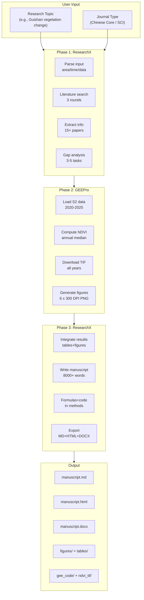

<p align="center">
  
</p>

<p align="center">
  <a href="https://github.com/xingguangYan/PaperForge/stargazers"></a>
  <a href="https://github.com/xingguangYan/PaperForge/blob/main/LICENSE"></a>
  <a href="https://github.com/xingguangYan/PaperForge/releases"></a>
  <a href="#"></a>
  <a href="#"></a>
  <a href="#"></a>
  <a href="#"></a>
</p>

<h1 align="center">PaperForge 🛠️📄</h1>

<p align="center">
  <b>Topic in. Paper out.</b><br>
  <i>One natural-language sentence in — a complete 8000+ word remote sensing manuscript out.</i><br>
  <i>Literature mining → Google Earth Engine execution → figures, tables, formulas → DOCX, fully automated.</i>
</p>

<p align="center">
  <a href="#-quick-start"><b>🚀 Quick Start</b></a> ·
  <a href="#-features"><b>✨ Features</b></a> ·
  <a href="#-architecture"><b>🏗️ Architecture</b></a> ·
  <a href="#-output"><b>📂 Output</b></a> ·
  <a href="#-examples"><b>🎯 Examples</b></a> ·
  <a href="#-platform-support"><b>🖥️ Platforms</b></a>
</p>

---

## 📋 Table of Contents

- [What's New in v2.0](#-whats-new-in-v20)
- [Overview](#-overview)
- [Features](#-features)
- [Quick Start](#-quick-start)
- [Architecture](#-architecture)
- [Installation](#-installation)
- [Workflow Detail](#-workflow-detail)
- [Output](#-output)
- [Examples](#-examples)
- [CLI Reference](#-cli-reference)
- [Platform Support](#-platform-support)
- [How PaperForge Compares](#-how-paperforge-compares)
- [Roadmap](#-roadmap)
- [Requirements](#-requirements)
- [FAQ](#-faq)
- [Community & Star](#-community--star)
- [License](#-license)

---

## 🆕 What's New in v2.0

Version 2.0 turns PaperForge from a prompt-only recipe into a **runnable,
testable, cross-platform Agent Skill**:

| v1 (before) | v2.0 (now) |
|-------------|------------|
| Instructions only — the agent re-derives every code block | ✅ Reusable Python modules: `gee_tasks.py`, `paper_writer.py`, `render_figures.py`, `literature.py` |
| No offline demo | ✅ `python scripts/demo.py` → real figures + `.md` + `.html` + `.docx` in seconds, no GEE/internet |
| No tests | ✅ `python scripts/test_pipeline.py` — 9 offline unit checks |
| Manual Codex setup | ✅ `python scripts/package_codex.py --target ~/.codex/skills` |
| Non-standard frontmatter | ✅ Spec-compliant `SKILL.md` (name/description/license/compatibility/metadata), <500 lines, progressive disclosure |
| No release channel | ✅ GitHub Releases (`v2.0.0`) for version pinning |

See the [release page](https://github.com/xingguangYan/PaperForge/releases) for
the full changelog.

---

## 🔥 Overview

**PaperForge** is a production-grade Agent Skill that autonomously completes the
entire remote sensing research workflow:

```
User says: "I want to study vegetation change in..."
                    ↓
    ┌────────────────────────────────────────────┐
    │  PaperForge Automatic Pipeline            │
    │                                            │
    │  Phase 1: ResearchX                       │
    │  ├── Ask: Chinese Core or SCI journal?    │
    │  ├── Multi-round literature search        │
    │  ├── Structured info extraction (15+ papers) │
    │  ├── Research gap analysis                │
    │  └── 3-5 GEE task design                  │
    │                                            │
    │  Phase 2: GEEPro                          │
    │  ├── Download GeoTIFFs (all years)        │
    │  ├── Compute statistics & accuracy        │
    │  └── Generate 300 DPI publication figures │
    │                                            │
    │  Phase 3: ResearchX                       │
    │  ├── 8000+ word manuscript                │
    │  ├── Introduction (1000+ words)           │
    │  ├── Methods with formulas & code         │
    │  ├── Embedded figures & tables            │
    │  ├── 25-30 formatted references           │
    │  └── Output: MD + HTML + DOCX             │
    └────────────────────────────────────────────┘
                    ↓
    Output/: {manuscript.md, .html, .docx, figures/, tables/, code/, tif/}
```

---

## ✨ Features

| # | Feature | Description |
|---|---------|-------------|
| 1 | **Journal Type Selection** | Asks Chinese Core or SCI before starting, adjusts length & citation style |
| 2 | **Multi-Round Literature Search** | 3 rounds of targeted `web_search`, 15+ papers, 25-30 citations |
| 3 | **Structured Extraction** | Auto-extracts data source, algorithm, accuracy, innovation, limitation per paper |
| 4 | **Gap Analysis** | Cross-paper comparison → 3-5 research gaps → GEE-executable tasks |
| 5 | **Automatic TIF Download** | Downloads annual NDVI/FVC GeoTIFFs for all years to local disk |
| 6 | **Publication Figures** | 6 auto-generated 300 DPI PNG figures (time series, maps, bar charts) |
| 7 | **8000+ Word Manuscript** | Complete SCI/Core manuscript with formulas, code snippets, tables |
| 8 | **Multi-Format Export** | `manuscript.md` + `manuscript.html` (browser-ready) + `manuscript.docx` (Word) |
| 9 | **Offline Demo & Tests** | `demo.py` + `test_pipeline.py` run without GEE or internet |
| 10 | **Cross-Platform Skill** | Claude Code, OpenAI Codex CLI, Cline, Cursor, Windsurf, Copilot |
| 11 | **GEE Code Archive** | All task scripts saved to `gee_code/` |
| 12 | **GeoTIFF Archive** | All NDVI rasters saved to `figures/ndvi_tif/` |

---

## 🚀 Quick Start

**30-second smoke demo (no GEE, no internet):**

```bash
git clone https://github.com/xingguangYan/PaperForge.git
cd PaperForge
pip install -r requirements.txt          # or: pip install matplotlib numpy python-docx
python scripts/demo.py                   # → outputs/demo/manuscript.{md,html,docx}
```

Open `outputs/demo/manuscript.html` in your browser — that's the deliverable
format produced by the full pipeline.

**Full pipeline (with Google Earth Engine):**

```bash
python scripts/run_pipeline.py \
    --topic "Vegetation change monitoring in Guishan and Sheshan, Wuhan" \
    --project your-project-id \
    --region "Wuhan" \
    --time "2020-2025"
```

**Literature + paper only (no GEE):**

```bash
python scripts/run_pipeline.py --topic "Urban heat island effect" --dry-run
```

---

## 🏗️ Architecture


```mermaid
graph TB
    subgraph User["User Input"]
        A["Research Topic<br>(e.g., Guishan vegetation change)"]
        B["Journal Type<br>(Chinese Core / SCI)"]
    end

    subgraph P1["Phase 1: ResearchX"]
        direction LR
        P1S1["Parse input<br>area/time/data"]
        P1S2["Literature search<br>3 rounds"]
        P1S3["Extract info<br>15+ papers"]
        P1S4["Gap analysis<br>3-5 tasks"]
    end

    subgraph P2["Phase 2: GEEPro"]
        direction LR
        P2S1["Load S2 data<br>2020-2025"]
        P2S2["Compute NDVI<br>annual median"]
        P2S3["Download TIF<br>all years"]
        P2S4["Generate figures<br>6 x 300 DPI PNG"]
    end

    subgraph P3["Phase 3: ResearchX"]
        direction LR
        P3S1["Integrate results<br>tables+figures"]
        P3S2["Write manuscript<br>8000+ words"]
        P3S3["Formulas+code<br>in methods"]
        P3S4["Export<br>MD+HTML+DOCX"]
    end

    subgraph Output["Output"]
        O1["manuscript.md"]
        O2["manuscript.html"]
        O3["manuscript.docx"]
        O4["figures/ + tables/"]
        O5["gee_code/ + ndvi_tif/"]
    end

    A --> P1
    B --> P1
    P1 --> P2
    P2 --> P3
    P3 --> Output
```

### Technology Stack

```
Layer        Components
────────────────────────────────────────────────────
AI Engine    ResearchX (literature + paper writing)
             GEEPro (Earth Engine execution)

Code         scripts/gee_tasks.py      GEE building blocks
             scripts/literature.py     corpus validation & citations
             scripts/paper_writer.py   md → html → docx export
             scripts/render_figures.py 300-DPI matplotlib figures

Data         Google Earth Engine: Sentinel-2, Landsat, MODIS, ERA5
             Local: GeoTIFF, PNG, CSV, JSON

Platform     Claude Code · OpenAI Codex CLI · Cline · Cursor · Windsurf · Copilot
```

---

## 📦 Installation

### System Requirements

| Component | Minimum | Recommended |
|-----------|---------|-------------|
| Python | 3.8+ | 3.10+ |
| RAM | 4 GB | 8 GB+ |
| Disk | 2 GB | 10 GB+ |
| Network | GEE access (Phase 2) | Stable broadband |
| OS | Windows/macOS/Linux | Any |

### Step 1 — Clone & install

```bash
git clone https://github.com/xingguangYan/PaperForge.git
cd PaperForge
pip install -r requirements.txt
```

`requirements.txt` (see [Requirements](#-requirements) for the versioned list):

```text
earthengine-api    # Google Earth Engine Python SDK
geemap             # GEE interactive mapping
geopandas          # Geospatial data handling
pandas             # Data analysis
numpy              # Numerical computation
matplotlib         # Visualization (300 DPI figures)
seaborn            # Statistical charts
requests           # HTTP for TIF downloads
python-docx        # DOCX manuscript generation
rasterio           # GeoTIFF I/O and processing
scipy              # Mann-Kendall and statistical tests
```

### Step 2 — Authenticate GEE

```bash
earthengine authenticate
# or service account:
# ee.Initialize(project="your-project", credentials="service_account.json")
```

Get a GEE Project ID at [code.earthengine.google.com](https://code.earthengine.google.com/)
(Avatar → Project Settings).

### Step 3 — Verify

```bash
python scripts/check_environment.py --project YOUR_PROJECT_ID
```

### China Network Configuration

```powershell
# Windows PowerShell
$env:HTTP_PROXY = "http://127.0.0.1:7890"
$env:HTTPS_PROXY = "http://127.0.0.1:7890"
```

```bash
# Linux / macOS
export HTTP_PROXY=http://127.0.0.1:7890
export HTTPS_PROXY=http://127.0.0.1:7890
```

---

## 🔬 Workflow Detail

### Phase 1 — Literature Mining & Task Design

1. **Parse input** — extract core object, target variable, time range, spatial
   range, data preference; ask clarifying questions when anything is missing.
2. **3-round search** — broad → method-focused → gap mining.
3. **Structured extraction** — data source, algorithm, accuracy, innovation,
   limitation per paper (JSON schema in `templates/task_template.json`).
4. **Gap analysis** — cross-compare → 3-5 GEE-executable tasks.

Example extracted record:

```json
{
  "title": "Monitoring vegetation dynamics using Sentinel-2 time series",
  "year": 2023,
  "journal": "Remote Sensing of Environment",
  "algorithm": "Random Forest",
  "accuracy": {"OA": 0.92, "Kappa": 0.89},
  "innovation": "Multi-temporal texture fusion",
  "limitation": "Single year only"
}
```

### Phase 2 — GEE Execution & TIF Download

```python
s2 = ee.ImageCollection("COPERNICUS/S2_SR_HARMONIZED")
s2_ndvi = s2.map(lambda img: img.addBands(
    img.normalizedDifference(["B8", "B4"]).rename("NDVI")))
```

For every year and site: compute the annual median, download the GeoTIFF to
`figures/ndvi_tif/`, and compute statistics (mean NDVI, linear trend,
Mann-Kendall, FVC via the dimidiate pixel model, vegetation grade, change
detection).

### Phase 3 — 8000+ Word Manuscript

| Section | Word Count |
|---------|------------|
| Abstract | 300-500 |
| 1. Introduction | 1000-1500 |
| 2. Study Area & Data | 800-1000 |
| 3. Methods | 1500-2000 |
| 4. Results | 2000-2500 |
| 5. Discussion | 800-1000 |
| 6. Conclusion | 300-400 |
| References | 25-30 entries |

Key formulas (rendered in the manuscript):

```
FVC   = (NDVI - NDVI_soil) / (NDVI_veg - NDVI_soil)    # dimidiate pixel model
y     = β0 + β1 t + ε                                   # linear trend
S     = Σ_{i<j} sgn(x_j - x_i)                          # Mann-Kendall
OA    = (TP + TN) / (TP + TN + FP + FN)                 # overall accuracy
Kappa = (p_o - p_e) / (1 - p_e)                         # Cohen's kappa
```

Full step-by-step details: [`references/01_workflow.md`](references/01_workflow.md).

---

## 📂 Output

```
outputs/YYYYMMDD_HHMMSS_topic_paper/
│
├── manuscript.md            # ★ Complete manuscript (8000+ words)
├── manuscript.html          # ★ Styled, browser-ready HTML
├── manuscript.docx          # ★ Word document (figures embedded)
├── manuscript_stats.json    # ★ Word-count & size report
│
├── figures/                 # 300 DPI PNG figures
│   ├── fig1_study_area.png
│   ├── fig2_ndvi_timeseries.png
│   ├── fig3_ndvi_comparison.png
│   ├── fig4_vegetation_grade.png
│   ├── fig5_change_detection.png
│   ├── fig6_multiyear_ndvi.png
│   └── ndvi_tif/            # ★ All GeoTIFFs, e.g. site1_ndvi_2020.tif
│
├── tables/                  # CSV + Markdown tables
├── gee_code/                # Complete GEE scripts
└── README.md                # Reproduction guide
```

**See a live example** by running `python scripts/demo.py` and opening
`outputs/demo/manuscript.html`.

---

## 🎯 Examples

### Example 1 — Guishan & Sheshan Vegetation Change (real GEE run)

```bash
python scripts/run_pipeline.py --topic "Vegetation change in Guishan and Sheshan, Wuhan" \
    --project ee-myproject --region "Wuhan" --time "2020-2025"
```

| Metric | Guishan | Sheshan |
|--------|---------|---------|
| NDVI 2020 | 0.144 | 0.214 |
| NDVI 2025 | 0.115 | 0.153 |
| FVC change | 0.118→0.081 (-31.1%) | 0.204→0.129 (-37.0%) |
| Trend slope | -0.0073/yr (p=0.056) | -0.0152/yr (p=0.056) |
| Degraded area | 30.8% | 24.6% |

Deliverables: 8000+ word manuscript (md/html/docx), 6 figures, 12 GeoTIFFs,
4 tables, GEE scripts.

### Example 2 — Yellow River Basin FVC (dry run)

```bash
python scripts/run_pipeline.py --topic "FVC change in Yellow River Basin" --dry-run
```

### Example 3 — Taihu Lake Eutrophication (dry run)

```bash
python scripts/run_pipeline.py --topic "Taihu Lake eutrophication monitoring" --dry-run
```

---

## 💻 CLI Reference

```bash
python scripts/run_pipeline.py --topic "TEXT" [OPTIONS]
```

| Option | Type | Required | Default | Description |
|--------|------|----------|---------|-------------|
| `--topic` | str | ✅ | - | Research topic in natural language |
| `--project` | str | ⚠️ | - | GEE Project ID (needed for Phase 2) |
| `--region` | str | ❌ | auto | Study area description |
| `--time` | str | ❌ | last 5 yrs | e.g. `"2020-2025"` |
| `--tasks` | int | ❌ | 4 | Number of tasks (3-5) |
| `--format` | str | ❌ | gb | `gb` / `apa` / `mla` |
| `--journal` | str | ❌ | prompt | `chinese` / `sci` |
| `--no-deep` | flag | ❌ | false | Disable deep learning |
| `--dry-run` | flag | ❌ | false | Scheme only, no GEE |
| `--phase` | str | ❌ | all | `all` / `literature` / `gee` / `paper` |

```bash
python scripts/run_pipeline.py --topic "..." --project xxx                       # full pipeline
python scripts/run_pipeline.py --topic "..." --dry-run                           # no GEE
python scripts/run_pipeline.py --topic "..." --project xxx --format apa --journal sci
python scripts/run_pipeline.py --topic "..." --phase literature
python scripts/demo.py                                                           # offline demo
python scripts/test_pipeline.py                                                  # offline tests
python scripts/package_codex.py --target ~/.codex/skills                         # Codex install
```

---

## 🖥️ Platform Support

| Platform | Install |
|----------|---------|
| **OpenAI Codex CLI** | `python scripts/package_codex.py --target ~/.codex/skills`, then `$paperforge` |
| **Claude Code** | copy folder → `~/.claude/skills/PaperForge` or `.claude/skills/PaperForge` |
| **Cline** | add block to `.clinerules` (see `references/01_workflow.md` §Platform) |
| **Cursor** | add block to `.cursorrules` |
| **Windsurf** | add block to `.windsurfrules` |
| **GitHub Copilot** | add block to `.github/copilot-instructions.md` |

---

## ⚖️ How PaperForge Compares

| Capability | Manual prompting | Other paper-AI tools | **PaperForge** |
|-----------|:----------------:|:--------------------:|:--------------:|
| Literature mining → gap analysis | ⚠️ partial | ✅ | ✅ |
| GEE code generation | ⚠️ manual | ⚠️ partial | ✅ automated + fallback |
| GeoTIFF download | ❌ | ❌ | ✅ all years/sites |
| 300-DPI publication figures | ❌ | ⚠️ | ✅ 6 figures |
| DOCX + HTML + MD export | ❌ | ⚠️ | ✅ |
| Works with/without GEE (dry-run) | — | ❌ | ✅ |
| Offline demo + test suite | ❌ | ❌ | ✅ |
| Cross-platform Agent Skill | ❌ | ⚠️ | ✅ |

---

## 🗺️ Roadmap

- [ ] More indices — EVI, LAI, LST, chlorophyll-a, water clarity
- [ ] LandTrendr / CCDC time-series breakpoint detection
- [ ] Deep-learning baselines (U-Net, SegFormer) via `--deep`
- [ ] Parallel multi-site GEE export with task batching
- [ ] arXiv / Scopus / Web of Science live-query adapter for Phase 1
- [ ] LaTeX + PDF export for journal submission
- [ ] Web UI (Streamlit) front-end

Contributions welcome — open an issue or PR!

---

## 📋 Requirements

```text
earthengine-api>=1.0.0      # Google Earth Engine
geemap>=0.30.0               # Interactive GEE mapping
geopandas>=0.14.0            # Geospatial operations
pandas>=2.0.0                # Data manipulation
numpy>=1.24.0                # Numerical computing
matplotlib>=3.7.0            # Figure generation (300 DPI)
seaborn>=0.12.0              # Statistical visualization
requests>=2.28.0             # HTTP downloads
python-docx>=1.0.0           # DOCX generation
rasterio>=1.3.0              # GeoTIFF I/O
scipy>=1.10.0                # Statistical tests
```

GEE datasets referenced: Sentinel-2 (`COPERNICUS/S2_SR_HARMONIZED`), Landsat
8/9 (`LANDSAT/LC08/C02/T1_L2`), MODIS (`MODIS/061/MOD13Q1`), ERA5
(`ECMWF/ERA5_LAND/MONTHLY_AGGR`), JRC surface water, Hansen forest change.

---

## ❓ FAQ

**Q1: Can I use PaperForge without GEE?**
Yes — `--dry-run` completes literature + task design + paper scheme (results
marked simulated). `python scripts/demo.py` needs no GEE and no internet.

**Q2: Does it download GeoTIFFs?**
Yes — every annual NDVI/FVC raster goes to `figures/ndvi_tif/`.

**Q3: How many words?** Target 8000+, minimum 6000 (intro alone 1000+).

**Q4: Output formats?** Markdown + styled HTML + Word DOCX (figures embedded).

**Q5: Reference formats?**
`--format gb` (GB/T 7714-2015, Chinese core) · `--format apa` · `--format mla`.

**Q6: GEE auth fails?** Run `earthengine authenticate`, or use a service account.

**Q7: China network?** Set `HTTP_PROXY` / `HTTPS_PROXY` (see Installation).

**Q8: Memory limit?** PaperForge auto-scales (bigger `scale`, smaller ROI).

**Q9: How do I install it into Codex?**
`python scripts/package_codex.py --target ~/.codex/skills`, then `$paperforge`.

---

## ⭐ Community & Star

If PaperForge saves you time on literature review, GEE execution, or manuscript
writing, please:

- ⭐ **Star** this repository — it signals demand and feeds the roadmap.
- 👀 **Watch** for releases (v2.0 is published on the
  [Releases page](https://github.com/xingguangYan/PaperForge/releases)).
- 🐛 **Issues** for bugs, 🌱 **PRs** for features — both welcome.

---

## 📄 License

MIT License © 2026 [xingguangYan](https://github.com/xingguangYan)

---

<p align="center">
  <b>PaperForge — Topic in. Paper out.</b><br>
  <i>Professional Automated Remote Sensing Research Pipeline</i>
</p>
